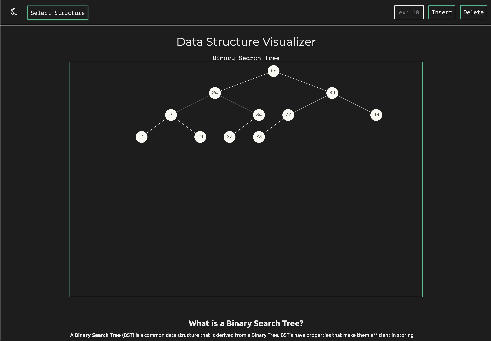
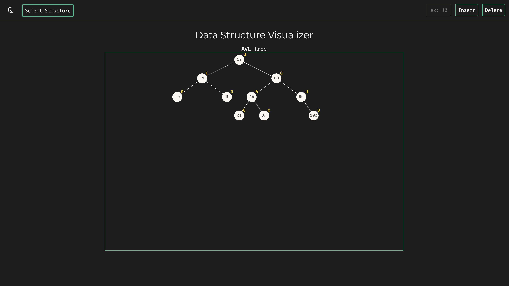

# Data Structure Visualizer

AI is good at explaining how data structures work, but still has a long way to go in order to create visualizations that are intuitive to beginners. This web application intends to help fill that gap, by providing visualizers for common data structures, along with a description and code example implementing the data structure.

This application has not yet been released to the web, as it is still a work in progress. You can check out the current version yourself by cloning the repository and then running `npm run dev`.

## Example Images

### BST

### AVL

