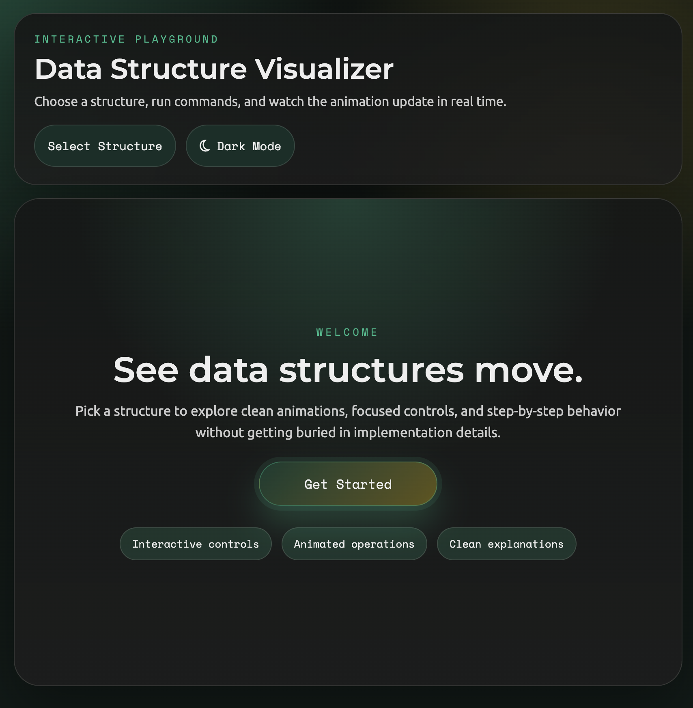
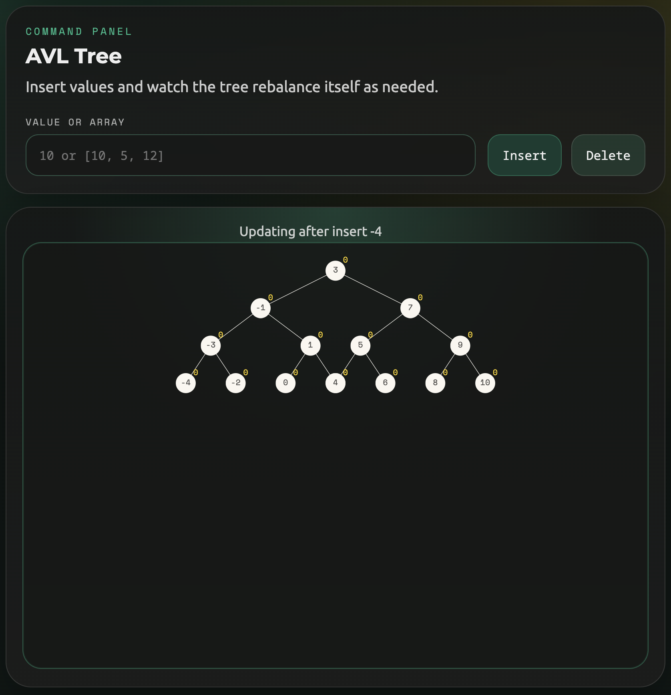
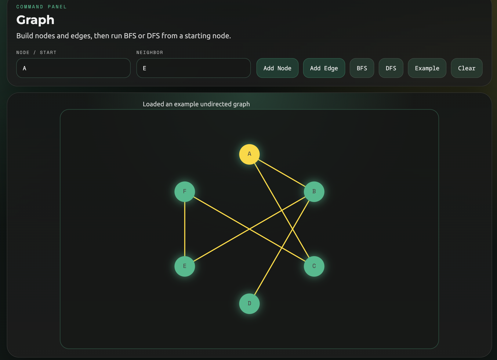
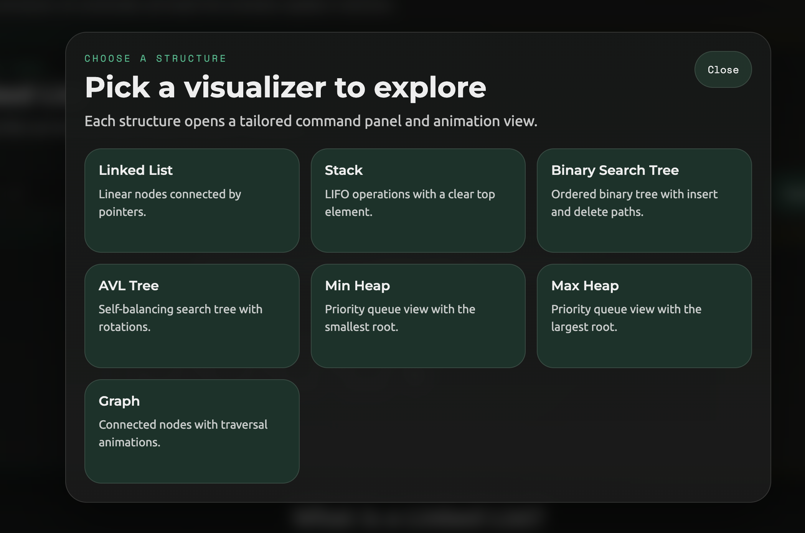

# Data Structure Visualizer

Interactive visualizer for exploring core data structures through direct manipulation and animation. The project is designed to make structural behavior easier to understand by pairing each visualizer with structure-specific controls and concise explanations.



## Overview

- Visualizes linked lists, stacks, binary search trees, AVL trees, min heaps, max heaps, and graphs
- Animates operations such as traversal paths, insertions, deletions, pushes, pops, and graph searches
- Includes structure-aware control panels and explanation sections for each view
- Built as a frontend-focused React + TypeScript project with SVG-based rendering

## Tech Stack

- React
- TypeScript
- Vite
- D3
- VisX

## Run Locally

```bash
npm install
npm run dev
```

Useful scripts:

```bash
npm run build
npm run lint
```

## Purpose

This project demonstrates interactive UI work for technical education tooling: translating abstract data-structure behavior into clear visual feedback, operation-specific animation, and a lightweight teaching interface.

## License

This project is under the MIT license. See [LICENSE](LICENSE).


## Additional Images






